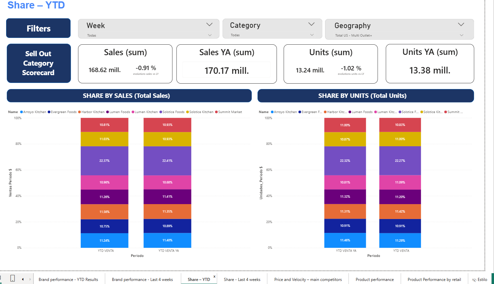
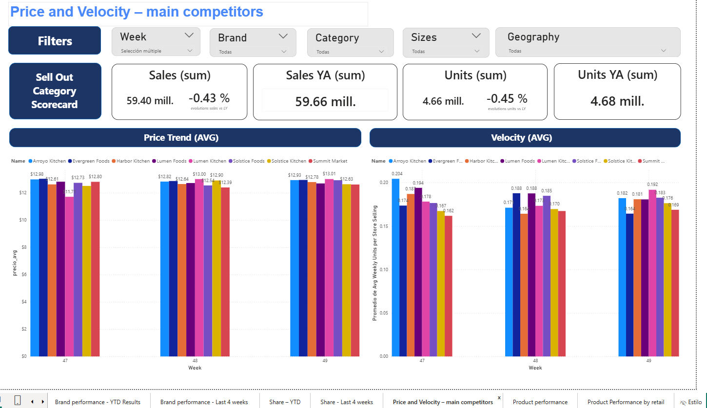
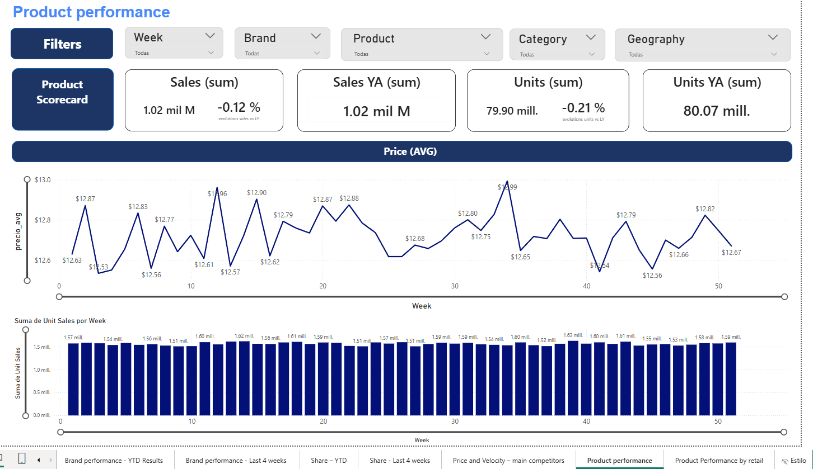

# Power BI Retail Analytics Dashboard (Sell Out, Share, Pricing & Velocity)

Interactive dashboard developed in Power BI to analyze retail commercial performance, focused on Sell Out, Market Share, Price Trends, and Velocity, including year-over-year (YA) comparisons.

This project is designed to answer key business questions such as:

- Which brands and products are performing best in the last weeks?
- How is performance trending compared to last year?
- Which brands lead market share by sales and units?
- How do pricing and velocity behave across competitors?

---

## Preview

Add screenshots to your repository and reference them here.

### Brand performance (Last 4 weeks)

### Share (YTD)

### Price and Velocity (Main competitors)

### Product performance

---

## Project Objective

Build an executive and analytical dashboard that enables:

- Weekly monitoring of business performance
- Sales and units comparison versus previous year (YoY)
- Market share tracking by sales and units
- Price average trend analysis and sales velocity measurement
- Filtering by Week, Brand, Category, Product, Sizes, and Geography

---

## Key Metrics (KPIs)

The report includes scorecards with the main indicators:

- Sales (sum): total sales for the selected period
- Sales YA (sum): sales for the same period last year
- Units (sum): total units sold
- Units YA (sum): units for the same period last year
- ACV (max) and ACV YA (max): weighted distribution indicator (All Commodity Volume)
- Stores selling (max): stores currently selling
- Number of stores (max): total stores in coverage
- Evolution %: variation compared to last year

All KPIs are designed to provide quick performance visibility and then allow drilling down into product and brand detail.

---

## Report Pages

### 1) Brand performance - Last 4 weeks

Short-term monitoring view by brand:

- Weekly sales trend
- Comparison versus last year
- Product sales table with rankings and evolution

Best for weekly follow-ups and fast decision making.

---

### 2) Share - YTD

Year-to-date market share view:

- Share by sales (Total Sales)
- Share by units (Total Units)
- Comparison versus last year (YTD vs YTD YA)

Best for understanding competitive positioning and category leadership.

---

### 3) Price and Velocity - Main competitors

Competitive analysis to evaluate pricing and rotation:

- Average price trend
- Velocity trend (Avg weekly units per store)

Best for pricing strategy, assortment decisions, and trade marketing analysis.

---

### 4) Product performance

Product-focused analysis:

- Weekly sales and units performance
- Average price evolution (line)
- Units sold (bars)
- Full filter support for deep dives

Best for identifying top products, declines, and growth opportunities.

---

## Tech Stack

- Power BI Desktop
- Power Query (ETL)
- DAX measures
- Data source: Excel / SharePoint / OneDrive
- Data modeling approach: star schema

---

## Data Source and Refresh

The report is designed to connect to an Excel file stored in OneDrive/SharePoint.

Recommended stable connection method:

- SharePoint Folder connector (instead of public sharing URLs)

Example of valid site URL format:

https://<tenant>.sharepoint.com/personal/<user>/

Important considerations to avoid breaking visuals when changing the data source:

- Preserve column names
- Preserve table/sheet names
- Keep consistent data types
